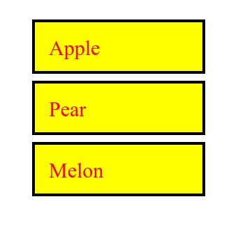
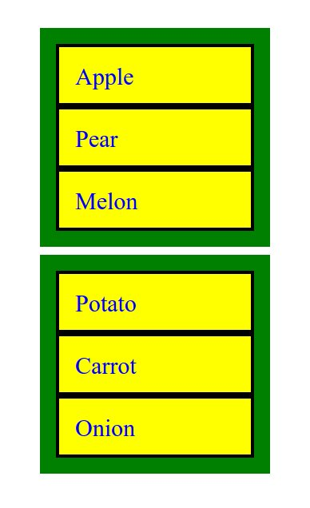
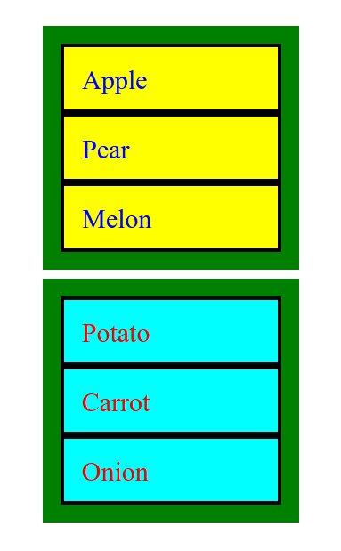
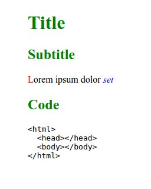
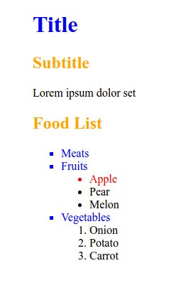
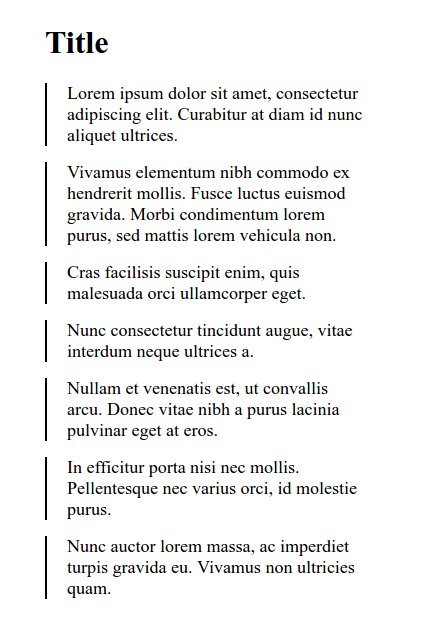
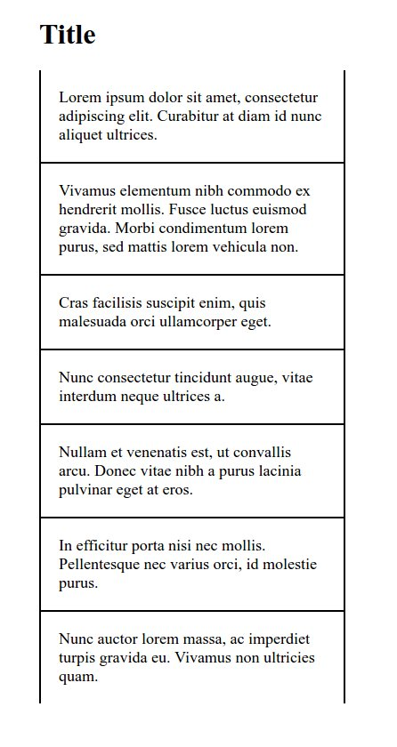
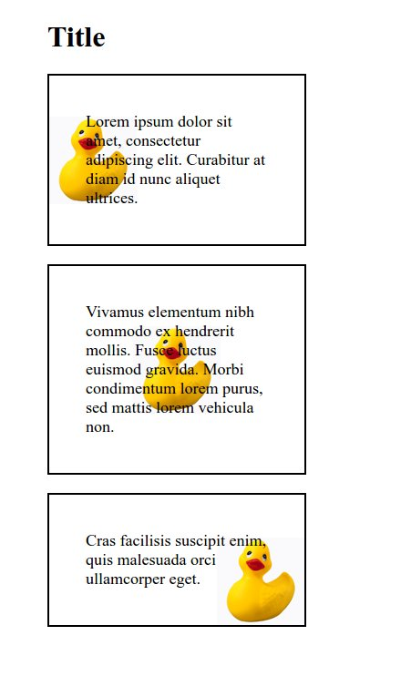

# Thursday - HTML & CSS

## Materials for this day
### HTML
 - https://www.youtube.com/watch?v=Y1BlT4_c_SU
 - https://www.youtube.com/watch?v=cZCq8lQ-vZ0
 - https://www.youtube.com/watch?v=IJWcX2EDAKg
 - https://www.youtube.com/watch?v=MnaKa7igX7k
 - https://www.youtube.com/watch?v=mNRzWMH5xK0
 - https://www.youtube.com/watch?v=XxZPrn1VFTc
 - https://www.youtube.com/watch?v=UWdepvkLE8U
 - https://www.youtube.com/watch?v=OwC4xNWihoM
 - https://www.youtube.com/watch?v=g6xsNHnAmlE
 - https://www.youtube.com/watch?v=f8pAb3IuECk
 - https://www.youtube.com/watch?v=HeQvQEiGMKk
 - https://www.youtube.com/watch?v=xkF-cKpzREU
 - https://www.youtube.com/watch?v=-XQlr727A8w
 - https://www.youtube.com/watch?v=9UNmumTYuq8
 - https://www.youtube.com/watch?v=Tc4IsPFB01E
 - https://www.youtube.com/watch?v=Gd0RBdFRvF0

Look after for what is the purpose of the: `<header>`, `<main>`, `<footer>`, `<section>`, `<article>` tag

### CSS
 - https://www.youtube.com/watch?v=4BEyFVufmM8 
 - https://www.youtube.com/watch?v=iqTgros3FTc
 - https://www.youtube.com/watch?v=1CqHws4WZ-M
 - https://www.youtube.com/watch?v=f7c7bTrqXic
 - https://www.youtube.com/watch?v=hrqo_GOwHHs
 - https://www.youtube.com/watch?v=4oPvurjpcNw
 - https://www.youtube.com/watch?v=ZMpaebQ3n6A
 - https://www.youtube.com/watch?v=lZ6R_eYYxoE
 - https://www.youtube.com/watch?v=3SOf8gZlBhI
 - https://www.youtube.com/watch?v=84KE7OwMjYY
 - https://www.youtube.com/watch?v=Qx-yzUBqatQ
 - https://www.youtube.com/watch?v=ggo0di5L6sA
 - https://www.youtube.com/watch?v=4YF-eaX4P0k
 - https://www.youtube.com/watch?v=0Sm7MkZXT-8
 - https://www.youtube.com/watch?v=sdn5p4kf91c

### Nice to have
 - https://developer.mozilla.org/en-US/docs/Web/HTTP
 - https://developer.mozilla.org/en-US/Learn/Getting_started_with_the_web/HTML_basics
 - https://developer.mozilla.org/en-US/Learn/Getting_started_with_the_web/CSS_basics
 - http://alistapart.com/article/grokwebstandards

## Assignment Review 
 - Purpose of: `<html>`, `<head>`, `<link>`, `<script>`,`<body>`, `<meta>`, `<title>`, `<h1>` - `<h6>`, `
`, `<a>`, ``, `<article>`, `<aside>`, `<strong>`, `<em>`, ``, `
`, `<header>`, `<main>`, `<footer>`, `<section>`, `<ul>`, `<ol>`, `<li>`, `<dd>`, `<dt>`, `<pre>`
 - class
 - id
 - Descendant selector
 - Conflict 
 - Inheritance 
 - Specificity
 - Box model
 - Shorthand
 - Default browser styles

## Workshop
Build these simple layouts in HTML and CSS

- Please create separate diractory for each problem.
- Make sure you are using the simpliest selectors as possible.
- Try to avoid code duplication.
- Use paint, gimp, or something similar to figure out the sizes and colors.
- You can use any lorem ipsum generator for the texts, it is not necessary to have the same

### Problem 1

Font size: 30 pixels

### Problem 2

Font size: 30 pixels

### Problem 3

Font size: 30 pixels

### Problem 4

### Problem 5

### Problem 6

Font size: 18 pixels

### Problem 7

Font size: 18 pixels

### Problem 8

Font size: 18 pixels

Duck: 

## Project work
[CV template](https://invis.io/X575YEGVU#/155416515_Greenfox-Anakins-Cv) to follow
Try to make a build as similar as possible to the design.

If you are ready:
 - create a copy
 - Modify the content to your CV
 - Build your own design
 - other [CV ideas](https://www.pinterest.com/hugabuga/cv-inspiration/) for the brave
