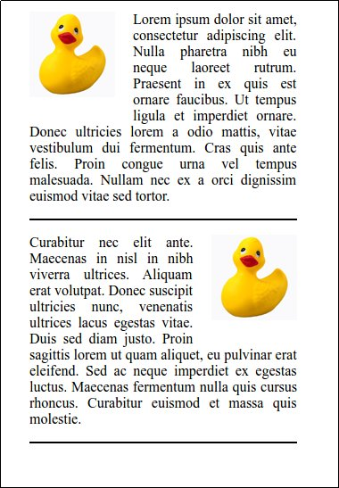
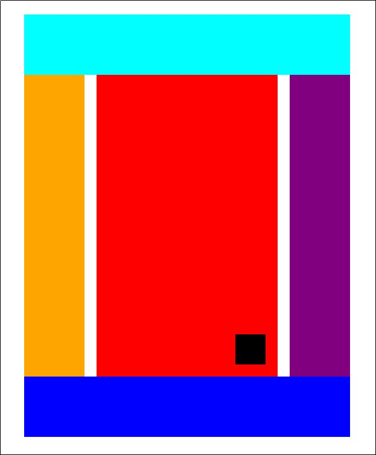
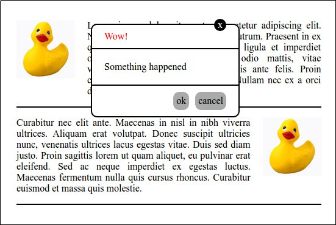

# Monday - Layout

## Materials for this day
 - https://css-tricks.com/box-sizing/
 - CSS positioning playlist: https://www.youtube.com/playlist?list=PL4cUxeGkcC9hudKGi5o5UiWuTAGbxiLTh
 - CSS flex-box playlist: https://www.youtube.com/playlist?list=PL4cUxeGkcC9i3FXJSUfmsNOx8E7u6UuhG

## Nice to have:
 - https://css-tricks.com/all-about-floats/
 - https://css-tricks.com/snippets/css/a-guide-to-flexbox/
 - http://alistapart.com/article/css-positioning-101
 - http://www.barelyfitz.com/screencast/html-training/css/positioning/

## Assignment Review checklist
 - box sizing
 - display:
   - block
   - inline
   - inline-block
   - none
 - float
 - clear
 - after, before
 - clearfix
 - vendor prefix
 - position:
   - static
   - relative
   - absolute
   - fixed
 - z-index
 - flex-box
   - purpose
   - orientation
   - positioning
 - overflow

## Workshop
Build these simple layouts in HTML and CSS

 - Please create separate diractory for each problem.
 - Make sure you are using the simpliest selectors as possible.
 - Try to avoid code duplication.
 - Use paint, gimp, or something similar to figure out the sizes and colors.
 - You can use any lorem ipsum generator for the texts, it is not necessary to have the same
 - Duck: 

### Problem 1

### Problem 2

 - It should be centered in the page.
 - It should have fixed width.
 - Consider the roles of the boxes:
   - Aqua (light blue): Header
   - Orange: Left sidebar (not main content)
   - Red: Main Content
   - Black: Fixed content on the bottom right of the Main content
   - Purple: Right sidebar (not main content)
   - Blue: Footer

### Problem 3

 - It should be wall to wall with fluid width.
 - The sidebars should have fixed with.

### Problem 4

 - You can reuse the 1st problem as background

### Project
 - Open the page: [https://en.wikipedia.org/wiki/Margaret_Hamilton_(scientist)](https://en.wikipedia.org/wiki/Margaret_Hamilton_(scientist))
 - Try to resize the browser window
 - Create a box for the:
   - Header
   - Main content
   - Sidebar
   - Footer
 - It should resize and work the same way as the original (Expect the resize of the sidebar, it can remain the same size)

#### Nice to have:
 - Add the bigger components as boxes:
   - Logo
   - Navigations
   - Search bar
   - Infobox in the content
   - Footer links
 
