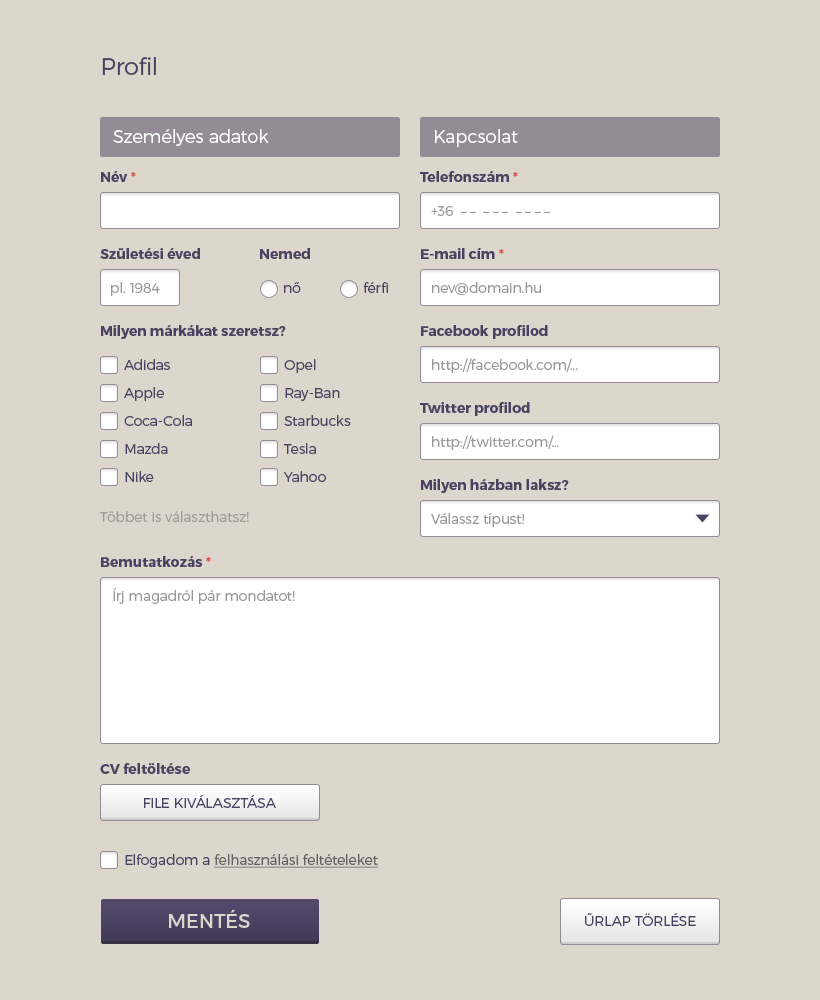

# Tuesday - Forms

## Materials for this day
 - https://developer.mozilla.org/en-US/docs/Web/Guide/HTML/Forms/My_first_HTML_form
 - https://css-tricks.com/video-screencasts/99-overview-of-html5-forms-types-attributes-and-elements/
 - http://www.smashingmagazine.com/2011/11/extensive-guide-web-form-usability/

## Assignment Review
 - `<form>` element
 - `action` attribute
 - `method` attribute
 - `<input>` element
 - `type` attribute
   - text
   - email
   - tel
   - number
   - date
   - search
   - color
   - range
 - `value` attribute 
 - `name` attribute
 - `<textarea>` element
 - `<label>` element
   - `for` attribute
 - custom attribures
   - placeholder
   - autofocus
   - maxlength
   - min, max, step
   - required
   - novalidation
 - submit
 - validation
 
## Workshop
 - Build a following design
 - Make sure you are using the simpliest selectors as possible.
 - Try to avoid code duplication.
 - Use paint, gimp, or something similar to figure out the sizes and colors.

[psd file](form.psd)

