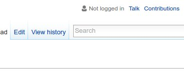
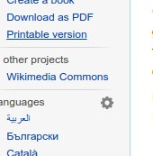
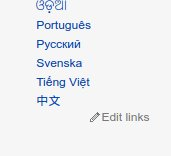
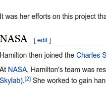
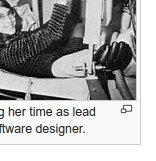
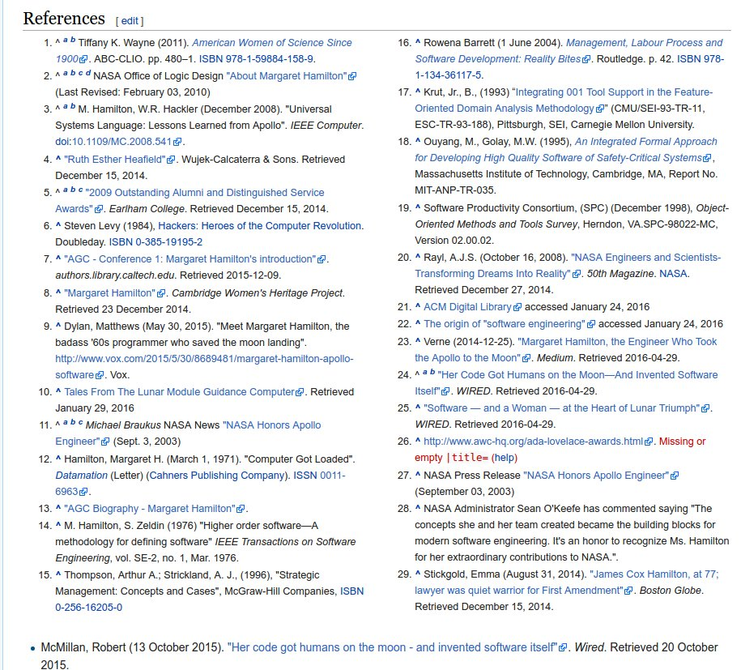
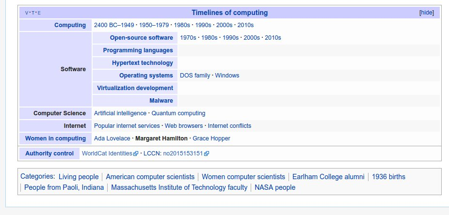
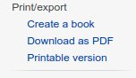
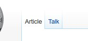

# Wednesday, Thursday - Advanced CSS

## Materials for this day
 - https://www.youtube.com/watch?v=YYMCcm4EM2M
 - https://www.youtube.com/watch?v=tYXQHuoaihU
 - https://www.youtube.com/watch?v=wTk4Wuckd0U
 - https://www.youtube.com/watch?v=Q1uowGztXGs
 - https://css-tricks.com/almanac/properties/o/outline/
 - https://developer.mozilla.org/en/docs/Web/HTML/Element/table

## Assignment Review
 - colors
 - opacity
 - gradients
 - box-shadow
 - outline
 - `<table>` element

## Workshop
Build the [Margaret Hamilton Wikipedia page](https://en.wikipedia.org/wiki/Margaret_Hamilton_(scientist))
 - Open the page
 - Try to resize the browser window
 - Create a box for the:
   - Header
   - Main content
   - Sidebar
   - Footer
 - It should resize and work the same way as the original (Expect the resize of the sidebar, it can remain the same size)
 - Figure out the bigger content component blocks in the Header, Main content, Sidebar and Footer, like: Logo, Navigations, Search bar, Infobox in the content, Footer links
 - Create boxes for these content as well and roughly do the positioning
 - Fill these components with the right content
 - Start to style these components (main colors, backgrounds, paddings, borders and margins first)
 
### The unnecessary details
Only start to work on these details if you are not ready with the others. These are not mandatory!

#### User icon

#### Gear icon

#### Edit links

#### Edit on headings

#### Full screen icon on images

#### Referneces

#### Bottom table

#### Gradient border under sidebar boxes
Normal border is enough

#### Gradient border between top menu
Normal border is enough

