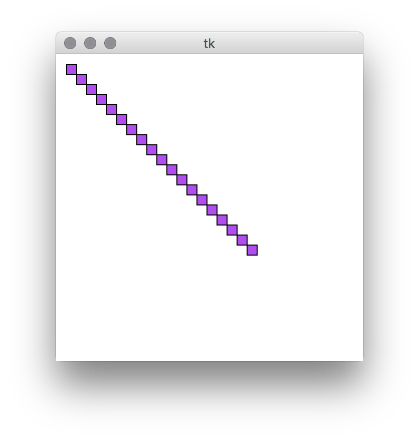
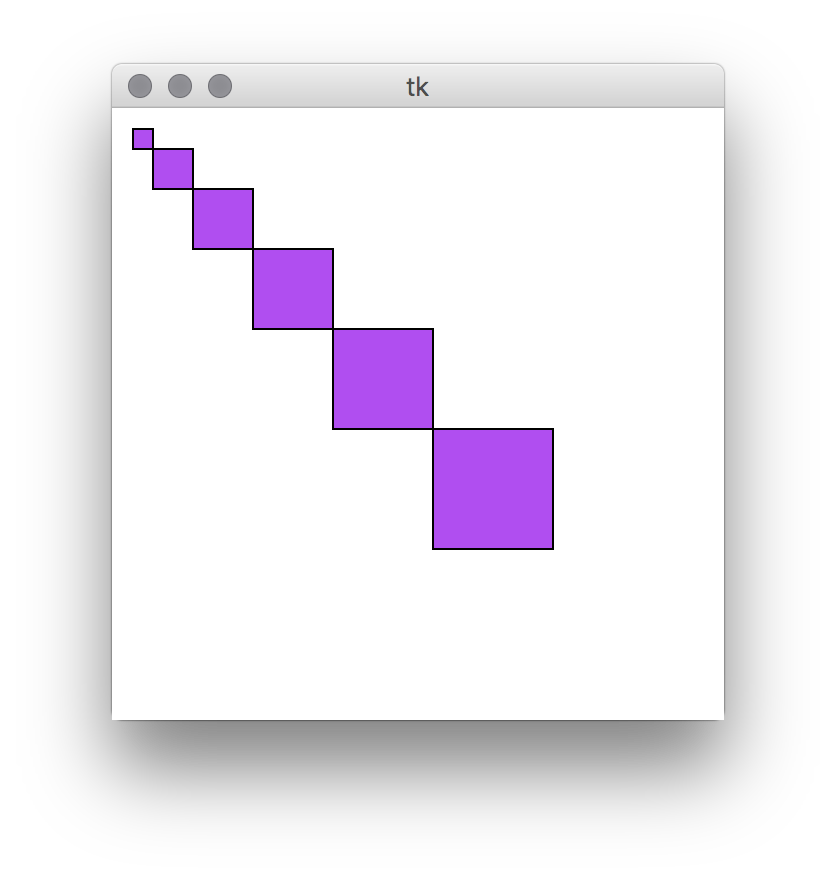
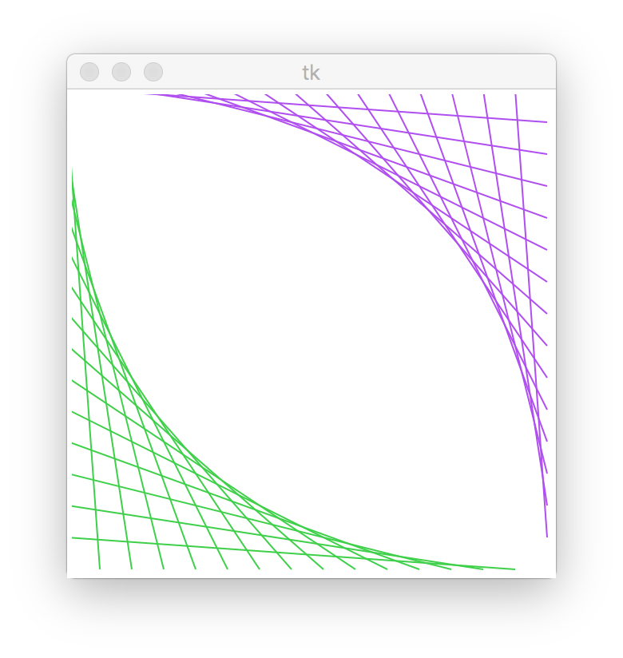
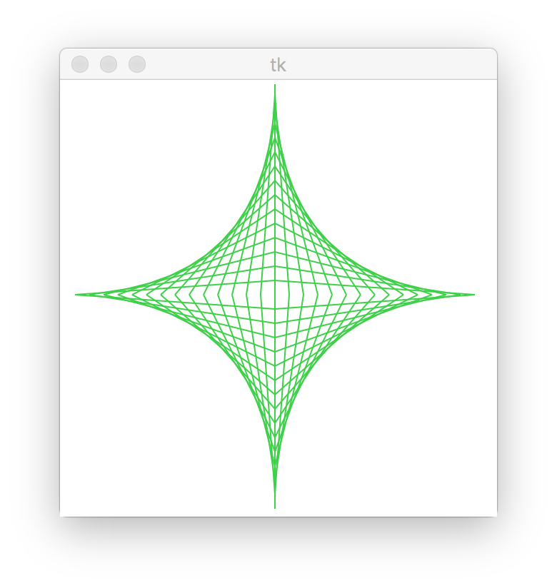
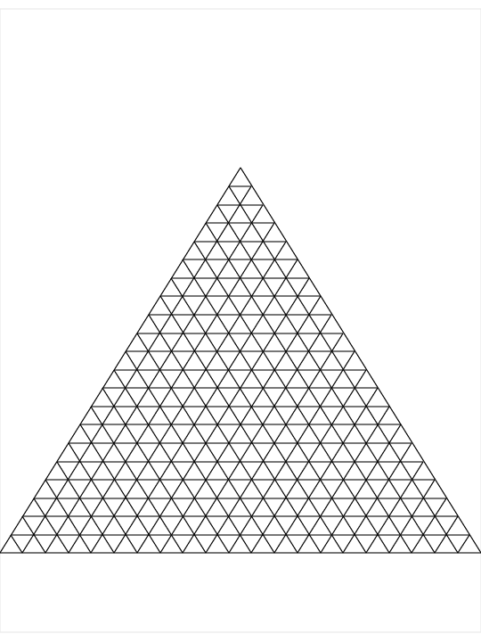
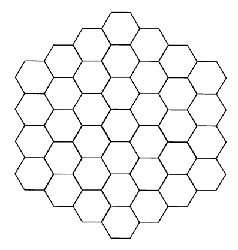

# Wednesday - Graphics

## Materials for this day
* https://www.youtube.com/watch?v=RJB1Ek2Ko_Y&index=1&list=PL6gx4Cwl9DGBwibXFtPtflztSNPGuIB_d
* https://www.youtube.com/watch?v=O12aT42okYE&list=PL6gx4Cwl9DGBwibXFtPtflztSNPGuIB_d&index=13
* http://www.tutorialspoint.com/python/tk_canvas.htm


### Nice to have
* http://www.python-course.eu/tkinter_canvas.php


## Workshop
* cheatsheet for the tasks with all the canvas methods: http://www.python-course.eu/tkinter_canvas.php


### TKinter
```python
from tkinter import *

root = Tk()

# here goes the drawing part

root.mainloop()

```

### Canvas
```python
from tkinter import *

root = Tk()

canvas = Canvas(root, width='200', height='100')
canvas.pack()

teal_line = canvas.create_line(0, 0, 200, 50, fill='light sea green')
lime_box = canvas.create_rectangle(50, 50, 100, 90, fill='lime green')
olive_oval = canvas.create_oval(120, 10, 180, 90, fill='olive drab')

root.mainloop()
```

### Exercises

- [01.py](workshop/01.py)
- [02.py](workshop/02.py)
- [03.py](workshop/03.py)
- [04.py](workshop/04.py)
- [05.py](workshop/05.py)
- [06.py](workshop/06.py)
- [07.py](workshop/07.py)
- [08.py](workshop/08.py)
- [09.py](workshop/09.py)
- [10.py](workshop/10.py)
- [11.py](workshop/11.py)
- Reproduce these:   
   
   
- [12.py](workshop/12.py)
- [13.py](workshop/13.py)
- [14.py](workshop/14.py)
- Reproduce these:   
   
   
- [15.py](workshop/15.py)
- [16.py](workshop/16.py)
- Reproduce these:
   
   
