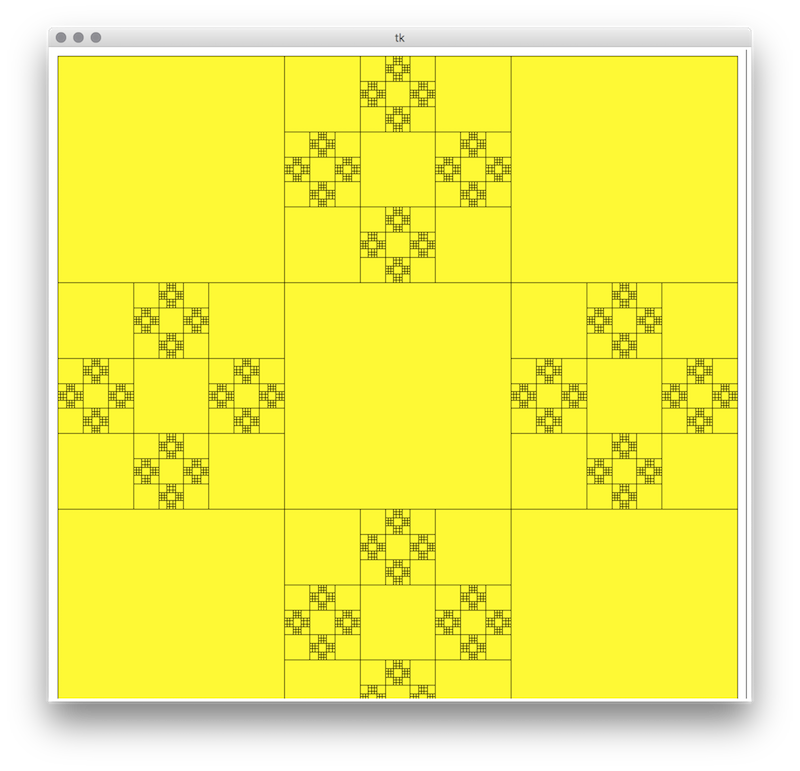

# Thursday - Recursion

## Before lesson materials
Khan academy series on iterative functions to Recursion   
* https://www.youtube.com/watch?v=ZyYp1V84Xqc&index=6&list=PL36E7A2B75028A3D6
* https://www.youtube.com/watch?v=dn9XjHz33O8&index=7&list=PL36E7A2B75028A3D6
* https://www.youtube.com/watch?v=EiR6cf8Towc&list=PL36E7A2B75028A3D6&index=8
* https://www.youtube.com/watch?v=JwO_25S_eWE&index=10&list=PL36E7A2B75028A3D6
* https://www.youtube.com/watch?v=6qCQB8E5bkI&list=PL36E7A2B75028A3D6&index=11
* https://www.youtube.com/watch?v=o920mj0NbhE&index=12&list=PL36E7A2B75028A3D6
* https://www.youtube.com/watch?v=kx6DfrYfWnQ&list=PL36E7A2B75028A3D6&index=13
* https://www.youtube.com/watch?v=urPVT1lymzU&list=PL36E7A2B75028A3D6&index=17
* https://www.youtube.com/watch?v=zg-ddPbzcKM&index=18&list=PL36E7A2B75028A3D6

Fractals   

* https://www.youtube.com/watch?v=WFtTdf3I6Ug

* check before lesson materials

### Nice to have
* https://www.ted.com/talks/benoit_mandelbrot_fractals_the_art_of_roughness?language=en


## Tasks

### Factorial with loop
```python
def factorial_iterative(number):
    product = 1
    for i in range(number):
        product *= i+1
    return product

print('5! is', factorial_iterative(5))
```

### Factorial with recursion
```python
def factorial(number):
    if number <= 1: #base case
        return 1
    else:
        return number * factorial(number-1)

print('5! is', factorial(5))
```

### Exercises
- [1.py](workshop/1.py)
- [2.py](workshop/2.py)
- [3.py](workshop/3.py)
- [4.py](workshop/4.py)
- [5.py](workshop/5.py)
- [6.py](workshop/6.py)
- [7.py](workshop/7.py)
- [8.py](workshop/8.py)
- [9.py](workshop/9.py)
- [10.py](workshop/10.py)
- 11: reproduce this:   

- [12.py](workshop/12.py)
- 13: reproduce this:   

