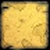
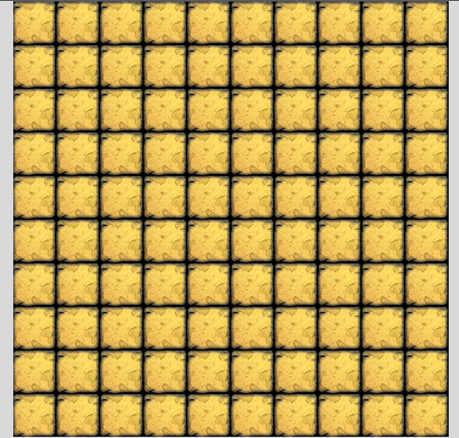
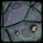
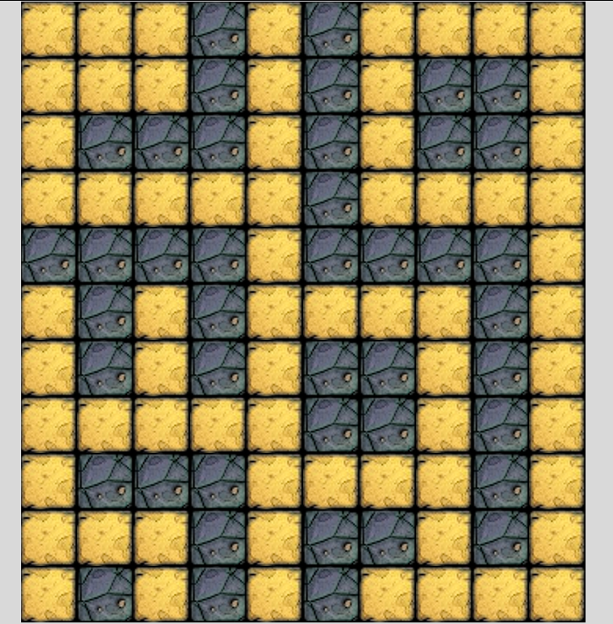
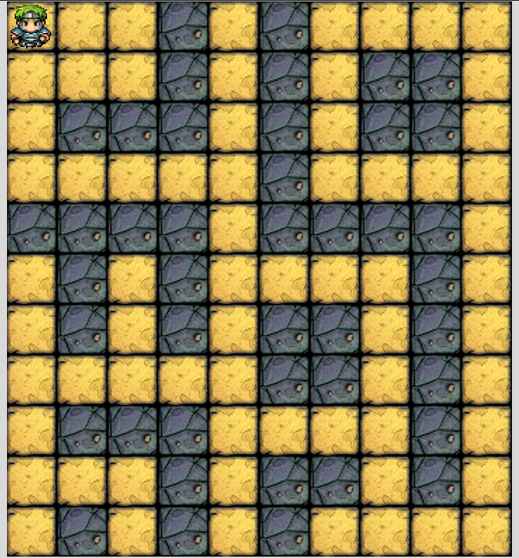
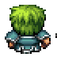
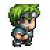
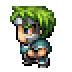
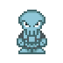
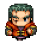

# Week 6 - Project
 
## Project for the week
 
### TkWanderer - The tkinter RPG game
This is a hero based walking on tiles and killing monsters type of game. Heroes and monsters have levels and stats depending on their levels.

#### The Game screen
- the screen contains the first area, which is 10x10 tiles where the hero (and the monsters) can move
    - every area contains 10x10 tiles
- there are tiles that cannot be occupied by any character (hero or monster)
- every area contains 3-6 monsters
- the monsters levels come from the number of the area
    - if its the Xth area, the mosters have lvl X (with 50% chance) or lvl X+1 (40%) or lvl X+2 (10%)
- one of the monsters is the boss
- one of the monsters (not the boss) is holding the key, so if it is killed the hero goes to the next area, but also the boss has to be killed
- the game screen also contains a text area where info of the characters' are provided
    - it shows all stats of the hero
    - if the hero is on the same tile with a monster, it shows all stats of the monster as well

#### Moving
- the hero can move tile-by-tile in four directions on the screen by using the corresponding arrows (or wsad if preferred)
- after every two move, the monsters move one tile as well

#### The Characters
-  every character has a (max and current) health point (HP), a defend (DP) and strike point (SP)
- these values can change during the game
- when a character's health point is 0 or below, it is dead
    - if its the hero, it is the end of the game

#### Starting stats
- Hero
    - HP: 20 + 3 * d6
    - DP: 2 * d6
    - SP: 5 + d6
- Monster Lvl x (if boss)
    - HP: 2 * x * d6 (+d6)
    - DP: x/2 * d6 (+d6/2)
    - SP: x * d6 (+x)

#### Battle
- when a hero enters a tile which is occupied by a monster, a battle forms
- the character entering the occupied tile is the attacker
- when the player hits `space` his hero strikes on the defender and then it strikes back
- the attacker strikes on the defender, then the defender strikes and this continues until one of the characters dies
- after a won battle if the character is a hero, it levels up

#### Strike
- on a strike a strike value (SV) is calculated from SP and a d6 doubled
- the strike is successful if 2*d6 + SP is higher than the other character's DP
- on a successful strike the other character's HP is decreased by the SV - the other character's DP

#### Leveling
- after successfully won battle the character is leveling up
- his max HP increases by d6
- his DP increases by d6
- his SP increases by d6

#### Entering next area
- when killing the monster who held the key to the next area, the hero enters immediately
    - which is like the previous one just with new and higher lvl monsters
- when entering a new area the hero has
    - 10% chance to restore all his HP
    - 40% chance to restore the third of his HP
    - 50% chance to restore 10% of his HP
- Monster Lvl x
    - HP: 2 * x * d6
    - DP: x/2 * d6
    - SP: x * d6
  
#### Stories
 
##### Tile
 - Given a terminal opened in the project directory
 - When the game is runned by executing `python main.py`
 - Then it should show a tile like this: 
 
##### Map
 - Given a terminal opened in the project directory
 - When the game is runned by executing `python main.py`
 - Then it should show a map of tile like this: 
 
##### Walls
 - Given the launched game
 - When the map is rendered on the screen
 - Then it should show floor  and wall type tiles as well: 
 
##### Hero
 - Given the launched game
 - When the map is rendered on the screen
 - Then it should show a hero on the top-left corner:  

 

##### Move down
 - Given the launched game
 - When the "down arrow key" is pressed by the user
 - Then the hero should move down one tile

##### Move around
 - Given the launched game
 - When any of the arrow keys are pressed by the user
 - Then the hero should move to that direction

##### Hero direction
 - Given the launched game
 - When the hero is moved by the arrow keys
 - Then the hero should face the direction where he went
    - Up: 
    - Right: 
    - Down: 
    - Left: 

##### Map boundaries
 - Given the hero on any edge of the map
 - When the hero is moved by the arrow keys towards the edge
 - Then it should not move, only its direction should change if necessary

##### Walls
 - Given the hero next to a wall tile
 - When the hero is moved by the arrow keys towards the wall tile
 - Then it should not move, only its direction should change if necessary

##### Skeletons
 - Give the launched game
 - When the map is rendered on the screen
 - Then 3 skeletons  should be on the map, somewhere on floor type tiles

##### Boss
 - Give the launched game
 - When the map is rendered on the screen
 - Then a boss  should be on the map, somewhere on floor type tiles

##### Stats
 - Give the launched game
 - When the map is rendered on the screen
 - Then stats should appear below the map in a white box as black strings
   - It should contain:
      - The level of the Hero
      - The max HP of the Hero
      - The current HP of the Hero
      - The DP of the Hero
      - The SP of the Hero
   - Like this: `Hero (Level 1)   HP: 8/10 | DP: 8 | SP: 6`

## Demo description
A tile map RPG game using python's Tkinter library
