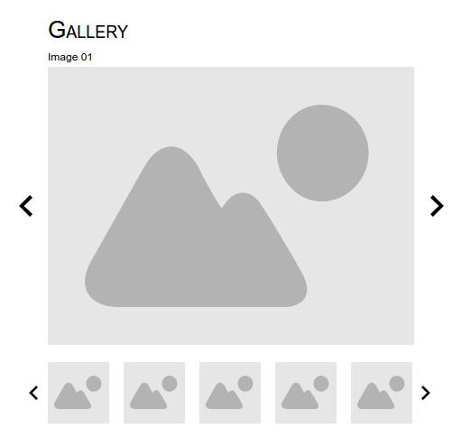

# Week 7 - JavaScript

## Project
Gallery

## Days
- Exam, Basics
- Array, Object
- DOM

## Demo description
Create a fully functional image gallery using HTML, CSS and JavaScript

### Features (must have)
- valid html, css, js
- page has title
- nice header
- show main/first image
- main arrows swipe the main image (previous and next)
- Image title shown

### Nice to have (not necessarily in this order)
- make it your own, design the style of the gallery
    - background
    - sizes, positioning and orientation
    - borders
    - fonts
    - CSS / JS animations
- list of thumbnails for all the images
- clicking on thumbnail loads the image to the main container
- only a few thumbnails showing, can move left and right with the arrows on the list

## How to do dis?

### Plan ALL the things!
- Imagine what you have to do
- Create sketch-up(s)
- Design your code, what will be where
- Plan your functions and variables

### Create your own stories
- Not necessarily in trello, but its a nice thing to do
- Break down the functions to simple ones, like:
    - Show the main image
    - Replace the main image with js
    - ...
